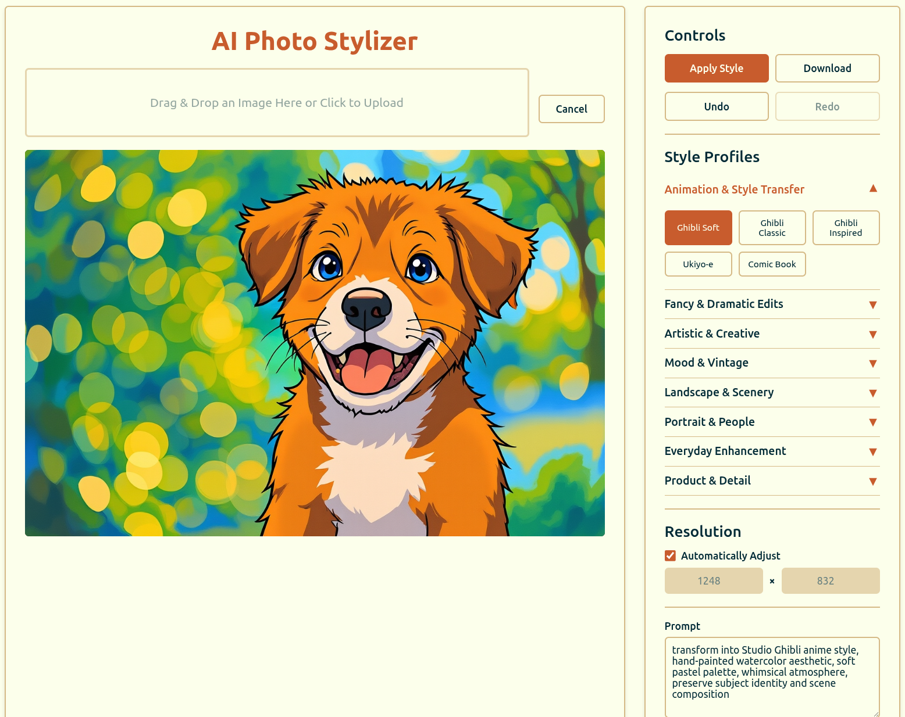

# GPT-4o Ghibli At Home: Your Private & Local AI Photo Stylizer

**Welcome to 4o-ghibli-at-home! Your own local and private, high-performance AI photo stylizer, powered by an enhanced `FLUX.1-Kontext-dev` and `DFloat11` model pipeline.**

This is not just a Ghibli-fier! The app has dozens of style profiles and advanced controls, you can transform your photos into everything from oil paintings and comic book art to cyberpunk cityscapes and vintage film stills. **Save your own custom styles, tweak the defaults, and use the app with _no login required_. Your images stay on your machine, always.**



## Major Features

- **Advanced Frontend**: A sophisticated, single-page application with:
  - Dozens of built-in **Style Profiles** organized by category (e.g., Animation, Artistic, Vintage).
  - **Custom Profile Management**: Save, load, and delete your own favorite settings.
  - **Undo/Redo** history for iterative editing.
  - Advanced controls for prompts, inference steps, guidance scales, and seeds.
- **Enhanced Model Pipeline**: Utilizes `black-forest-labs/FLUX.1-Kontext-dev` augmented with `DFloat11` for high-quality, efficient image generation.
- **Efficient VRAM Usage**: Automatically enables model CPU offloading on NVIDIA GPUs to run on consumer cards with less VRAM.
- **Environment-based Configuration**: Easily manage settings like queue size, file storage, and device selection using a `.env` file.
- **Persistent Storage & Cleanup**: Generated images are saved to disk, with an automatic background worker to clean up old job data and files to save space.
- **Intelligent Logging**: Uses `Loguru` for clean, readable logs and automatically filters out noisy status checks to keep the console tidy.
- **Robust FastAPI Backend**: The original Flask app has been migrated to a modern, high-performance FastAPI structure.
- **Asynchronous Task Queue with Redis**: Uses `arq`, a powerful and simple async task queue, with Redis to manage image generation jobs, allowing for true background processing and scalability.
- **GPU/CPU Agnostic**: Automatically uses an available NVIDIA GPU and gracefully falls back to the CPU (note: CPU is significantly slower).

## Quick Start

### Requirements

- **Python 3.11+**
  - `pip` or `uv` (Python package installer; `uv` is recommended for speed)
- **Redis**: A running Redis instance is required for the task queue.
  - You can run Redis locally using Docker: `docker run -d -p 6379:6379 redis:7`
- **NVIDIA GPU** (recommended for speed; CPU fallback supported)
  - **~21GB VRAM** is preferred for the best performance.
- Modern web browser (Chrome, Firefox, Edge, etc.)
- Some images to Ghiblify!

## Setup & Installation

### 1. Clone the Project

```bash
git clone https://github.com/TheAhmadOsman/4o-ghibli-at-home.git
cd 4o-ghibli-at-home
```

### 2. Create and Activate a Python Virtual Environment

A virtual environment is crucial for isolating project dependencies.

I recommend using `uv`. If you don't have `uv`, install it with `curl -LsSf https://astral.sh/uv/install.sh | sh` (macOS/Linux) or `powershell -c "irm https://astral.sh/uv/install.ps1 | iex"` (Windows). You may need to restart your terminal.

```bash
# Using uv (Recommended)
uv venv

# Or using Python's built-in venv
python3.11 -m venv .venv
```

After creating the environment, activate it:

```bash
# Activate (Windows)
.venv\Scripts\activate

# Activate (macOS/Linux)
source .venv/bin/activate
```

### 3. Install Dependencies

Install the Python dependencies from `pyproject.toml` (which now manages dependencies).

```bash
# Using uv (Recommended)
uv pip install -e .

# Using pip
pip install -e .
```

### 4. Configure Your Environment

The application is now configured using an environment file.

1. Rename `.env_template` to `.env` in the project's root directory.
2. Edit the contents of the example below into your new `.env` file and adjust the values as needed.

```ini
# .env.example - Copy this to a new file named .env

# --- Server Configuration ---
# Maximum upload size in Megabytes (MB).
MAX_UPLOAD_MB=25
# Folder to store generated images. Will be created automatically.
RESULTS_FOLDER="generated_images"

# --- Redis & ARQ Task Queue ---
REDIS_HOST="localhost"
REDIS_PORT=6379
REDIS_DB=0
# Maximum number of concurrent jobs the ARQ worker will process.
MAX_CONCURRENT_JOBS=2
# How long a job can run before it times out (in seconds).
JOB_TIMEOUT=600

# --- Job & Resource Management ---
# Device to run the model on ('cuda', 'cpu'). Defaults to 'cuda' if available.
PYTORCH_DEVICE="cuda"
# How long to keep job results in memory and on disk (in seconds). Default is 900 (15 minutes).
JOB_RESULT_TTL=900
```

## How to Run

The application now consists of two main components that must be run separately: the **FastAPI web server** and the **ARQ background worker**.

- **For Development (Recommended):**

    A helper script `run_dev.sh` is provided to start both processes concurrently.

    ```bash
    # Make the script executable (only needs to be done once)
    chmod +x run_dev.sh

    # Run the development server and worker
    ./run_dev.sh
    ```

- **For Production:**

    Use a production-grade ASGI server like Gunicorn to run the FastAPI app, and run the ARQ worker in a separate process (e.g., using `systemd` or a process manager).

    ```bash
    # 1. Start the FastAPI application with Gunicorn
    # The number of workers can be scaled based on your server's CPU cores.
    gunicorn -w 4 -k uvicorn.workers.UvicornWorker -b 0.0.0.0:5000 app.main:app

    # 2. In a separate terminal or process, start the ARQ worker
    arq app.services.task_queue.WorkerSettings
    ```

## Open the App

Once the server is running, open your web browser and navigate to:

**<http://127.0.0.1:5000>**

You can now upload an image and start stylizing!

## API Endpoints

- `POST /process-image` — Submits an image processing job. Returns a `job_id`.
- `GET /status/{job_id}` — Checks the status of a job (`queued`, `processing`, `completed`, `failed`). Returns `queue_position` if queued.
- `GET /result/{job_id}` — If the job is `completed`, returns the generated PNG image from the disk.
- `GET /api/profiles` — Retrieves the list of available style profiles.

## Project Structure

- `main.py` — The main entry point for launching the application.
- `app/` — The core FastAPI application directory.
  - `main.py` — FastAPI app initialization, middleware, and error handlers.
  - `core/` — Application configuration, logging, and lifespan events.
  - `models/` — Pydantic models for data validation and serialization.
  - `routers/` — API endpoint definitions (routes).
  - `services/` — Business logic, including the ML model and task queue services.
  - `utils/` — Helper functions.
- `static/` — The complete, dynamic frontend application.
- `pyproject.toml` — Project metadata and dependencies.
- `generated_images/` — (Default directory) Where generated images are stored.
- `.env` — (User-created from `.env_template`) File for all your local configuration.

## Deployment / Production Checklist

- [ ] Ensure a Redis instance is running and accessible to the application.
- [ ] Create and configure your `.env` file on the production server.
- [ ] Run the FastAPI app using a process manager like Gunicorn (see "How to Run").
- [ ] Run the `arq` worker as a separate, long-running service (e.g., using `systemd`).
- [ ] Use a reverse proxy like Nginx or Apache in front of the application for SSL/TLS, caching, and rate limiting.
- [ ] Set up log rotation for the output from your ASGI server and ARQ worker.
- [ ] Set up monitoring to watch server health and resource usage (CPU, GPU, RAM, Redis).
- [ ] (Optional) Add an authentication layer for private deployments.

## License

This project is licensed under the **GNU Affero General Public License v3.0 (AGPLv3)**.

- **Non-Commercial Use Only:**
    Commercial use of this software is **not permitted** without an explicit, written license from the author.

You are free to use, modify, and distribute this software for personal, research, or non-commercial purposes under the terms of the AGPLv3. If you make changes and deploy the software for public use (including as a service), you must make the complete source code of your modified version available under the same license.

For more details, see the [LICENSE](./LICENSE) file or visit:
[https://www.gnu.org/licenses/agpl-3.0.html](https://www.gnu.org/licenses/agpl-3.0.html)

## Support

Open issues on GitHub for bugs, help, or feature requests.

**Enjoy creating stunning images with your private AI!**
